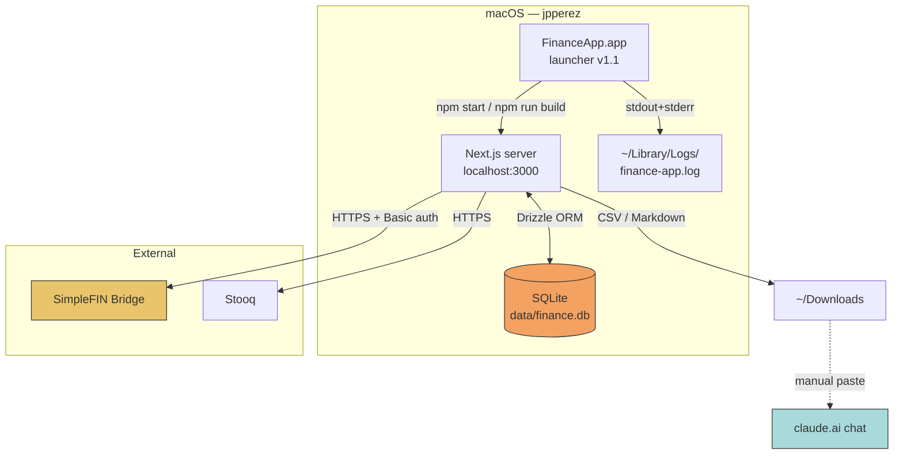
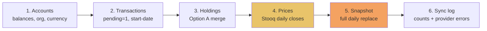
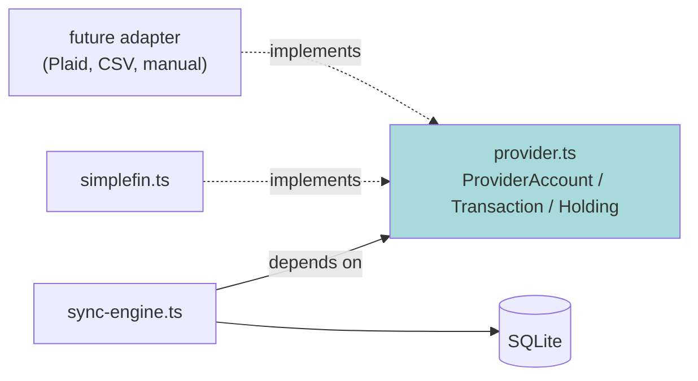
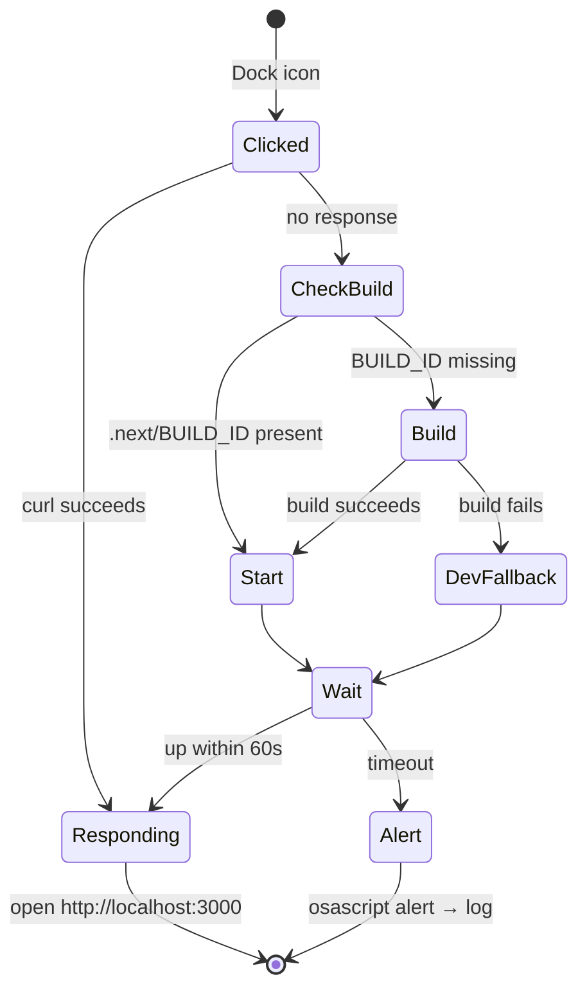

# Architecture

**Status:** active · **Version:** 1.0.0 · **Updated:** 2026-08-16

---

## 1. Shape of the system

finance-app is a **local-first monolith**. One Next.js process, one SQLite file, one user. There is
no service tier, no message queue, no cache layer, and deliberately no cloud component. The entire
system state is a single file on disk that can be copied with `cp`.



**Why a monolith.** The workload is one person opening an app a few times a week. Every distributed
pattern would add operational surface with no corresponding benefit, and would compromise the
property that actually matters: that the data never leaves the machine. See ADR-0001.

---

## 2. Layers

| Layer | Location | Responsibility |
|---|---|---|
| Presentation | `src/app/(app)/**/page.tsx` | Server components render aggregates; client components handle interaction (drag-and-drop, accordions, scope pill) |
| Server actions | `src/app/(app)/**/actions.ts` | Mutations — holdings CRUD, CSV import, SimpleFIN claim, widget layout persistence |
| Route handlers | `src/app/api/**/route.ts` | `POST /api/sync[?onlyIfStale=1]` — the one non-action entry point |
| Domain | `src/lib/*.ts` | `holdings`, `holdings-snapshots`, `portfolio`, `prices`, `settings`, money helpers |
| Integration | `src/lib/sync/*.ts` | Provider interfaces, SimpleFIN adapter, sync engine |
| Persistence | `src/db/schema.ts`, `src/db/index.ts` | Drizzle schema and handle |

**Aggregation happens on the server.** The view-scope filter (All / Cash / Investments / Debt) is a
cookie read server-side; the dashboard's totals are computed before render rather than filtered in
the browser. This keeps the client dumb and the numbers consistent across widgets.

---

## 3. The sync pipeline

Ordering is load-bearing. Each step depends on the previous one having completed.



| Step | Why here |
|---|---|
| Accounts first | Holdings and transactions reference accounts by external ID; the rows must exist |
| Holdings before prices | The price fetcher needs the current ticker set to know what to fetch |
| **Prices before snapshot** | The snapshot's `market_value_cents` prefers a live close; running it first would record stale or null values |
| Snapshot last | It captures the settled end state of the run |

`RunSyncResult` carries per-step telemetry:

```ts
/** Stooq price-fetch outcomes for held tickers + benchmarks (BUILD_SPEC §9). */
priceFetch?: { ticker: string; ok: boolean; pointsWritten: number; error?: string }[];
/** Holdings rows written from provider data (SimpleFIN holdings sync). */
holdingsSynced?: number;
```

**Triggers.** Manual "Sync now", or automatic on app open via `POST /api/sync?onlyIfStale=1`. The
staleness threshold is **1 hour** (originally 12h; relaxed because the app is opened deliberately,
not left running).

---

## 4. Directory structure

Reconstructed from build sessions — enumerate against the live tree to clear **`V-006`**.

```
/Users/jpperez/finance-app
├── data/finance.db                    # entire application state
├── drizzle/                           # generated migrations        [VERIFY V-003]
├── src/
│   ├── app/
│   │   ├── (app)/
│   │   │   ├── page.tsx               # Dashboard — widget grid
│   │   │   ├── accounts/              # accordion by type + subtotals
│   │   │   ├── transactions/
│   │   │   ├── budget/                # accordion by category group
│   │   │   ├── portfolio/
│   │   │   │   ├── page.tsx           # symbol trend + holdings table + exports
│   │   │   │   └── actions.ts         # createHolding/updateHolding/deleteHolding/importHoldingsCsv
│   │   │   ├── recurring/
│   │   │   ├── reports/               # Sankey cash flow
│   │   │   └── settings/
│   │   │       ├── simplefin-connect-form.tsx
│   │   │       └── actions.ts         # claim server action
│   │   ├── api/sync/route.ts
│   │   └── login/
│   ├── db/{index.ts, schema.ts}
│   └── lib/
│       ├── sync/{provider.ts, simplefin.ts, sync-engine.ts}
│       ├── holdings.ts
│       ├── holdings-snapshots.ts
│       ├── prices.ts
│       ├── portfolio.ts
│       ├── settings.ts
│       └── money.ts                   # parseCents / formatCents    [VERIFY V-002]
└── .next/BUILD_ID                     # launcher's production-build gate
```

---

## 5. Provider abstraction

The sync engine talks to interfaces, not to SimpleFIN. `src/lib/sync/provider.ts` defines
`ProviderAccount`, `ProviderTransaction`, `ProviderHolding`, and `SyncResult`; `simplefin.ts` is one
implementation.



The practical value today is not portability but **normalisation**: SimpleFIN returns money as
strings and shares as possibly-fractional decimal strings. The interface pins the contract —
`costBasisCents: number` (integer cents), `shares: string` (text, fractional-safe) — so the
conversion happens once, at the boundary, rather than being rediscovered at each call site.

---

## 6. Trust boundaries

| ID | Boundary | Control | Notes |
|---|---|---|---|
| `FA-TB-001` | Browser ⇄ server | Password login on `/login`; loopback binding | Binding unconfirmed — **`V-004`** |
| `FA-TB-002` | Server ⇄ SimpleFIN | Access URL with embedded Basic auth, stored in `settings`; claim and sync both server-side | No browser ever holds the credential; no CORS surface |
| `FA-TB-003` | Server ⇄ Stooq | Unauthenticated public endpoints | Ticker symbols appear in request URLs |
| `FA-TB-004` | App ⇄ external LLM | **Manual only** — export, download, paste | No API key in the app by design (ADR-0006) |

**The credential.** The SimpleFIN access URL embeds Basic auth inline. It is extracted and sent as
an `Authorization` header rather than left in the URL (`FA-BUG-001`), but it lives in the SQLite
file at rest. That is acceptable for a local single-user app and is exactly why `data/` is
git-ignored and backed up manually rather than synced.

---

## 7. State model: current-state plus dated history

The single most consequential structural decision.

| Concern | Current-state table | History table |
|---|---|---|
| Account balances | `accounts.balance` | `balance_snapshots` (daily) |
| Positions | `holdings` (overwritten each sync) | `holdings_snapshots` (daily) |
| Prices | — | `security_prices` (daily) |

Current-state tables are cheap to query and always reflect reality. History tables are append-shaped
and answer "what changed." Mixing the two into a single versioned table was rejected: every
dashboard query would need a "latest" predicate, and the hot path is overwhelmingly current state.

**The cost of this design** is that history only exists from the day each snapshot feature shipped.
It cannot be backfilled. That is a stated, accepted limitation — see ADR-0004.

---

## 8. Runtime model



The app runs in **production mode**, which means the compiled bundle is the executing artifact.
Source edits do nothing until `npm run build`. This is the most frequent operational trip-hazard in
the project's history and is why the launcher self-heals a missing build rather than failing.

---

## 9. What this architecture deliberately does not have

Stated so future changes are made with the trade-off visible:

| Absent | Why |
|---|---|
| Multi-user / auth roles | Single user. A password gate is sufficient. |
| Server-side scheduler | Sync happens on open. No daemon to supervise, no cron to debug. The cost: no snapshot on days the app is not opened. |
| Cloud sync / hosted DB | The whole point is that the data does not leave the machine. |
| API keys for LLM analysis | Structural, not incidental — see ADR-0006. |
| Currency conversion | Fields exist end-to-end; no conversion logic (`FA-OPEN-005`). |
| Automated tests | **Genuine gap.** Defects have been caught in production by page crashes. Regression coverage on `formatCents`, the Sankey key builder, and the sync engine would have caught three of six logged defects. |
