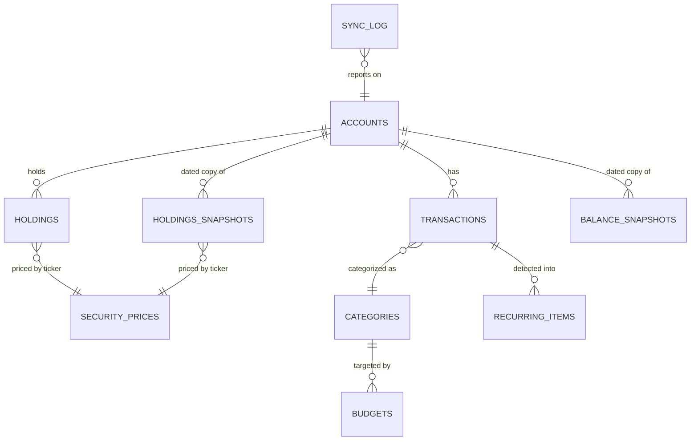

# Data model

**Status:** active · **Version:** 1.0.0 · **Updated:** 2026-08-16

Single SQLite database at `data/finance.db`, defined by Drizzle in `src/db/schema.ts`. That file is
the sole source of truth for schema; migrations are generated from it, never hand-written.

---

## 1. Invariants

### `FA-INV-001` — All money is integer cents

```
Ingest:   parseCents(string)   string math, never parseFloat
Store:    INTEGER              cents, never a real
Render:   formatCents(int)     throws on non-integer input
Detect:   typeof(col) = 'real' in SQLite is a corruption signal
```

This is enforced by a strict guard at render time, which means a violation surfaces as a **page
crash**, not a rounding error. That is intentional — a wrong number displayed confidently is worse
than a page that refuses to render.

It has been violated once. `FA-BUG-002`: the recurring-detection median wrote fractional cents into
`recurring_items.expected_amount`, and the Recurring page died in `formatCents`. Detection and
repair:

```bash
sqlite3 data/finance.db "SELECT COUNT(*) FROM recurring_items WHERE typeof(expected_amount)='real';"
cp data/finance.db data/finance.db.bak-$(date +%Y%m%d)
sqlite3 data/finance.db \
  "UPDATE recurring_items SET expected_amount = CAST(ROUND(expected_amount) AS INTEGER)
   WHERE typeof(expected_amount)='real';"
```

### `FA-INV-002` — Shares are text, not numbers

Fractional shares are real (`"100.03"`). Stored as `text` to avoid float drift; converted with
`Number()` only at the point of a market-value multiplication, guarded by `Number.isFinite`.

### `FA-INV-003` — Current-state tables carry no history

`holdings` and `accounts` are overwritten. Anything needing a time series reads a `*_snapshots` or
`security_prices` table. Never add a `valid_from` column to a current-state table; add a snapshot
row instead.

---

## 2. Table inventory

Complete enumeration pending **`V-005`** (`sqlite3 data/finance.db ".tables"`).

| ID | Table | Kind | Purpose |
|---|---|---|---|
| `FA-DM-001` | `accounts` | current-state | One row per account. Type drives scope filters, accordion grouping, and net-worth breakdown |
| `FA-DM-002` | `transactions` | append | Synced and imported; pending flagged; categorized |
| `FA-DM-003` | `categories` + groups | reference | Budget hierarchy; group names must be namespaced when building graph nodes (`FA-BUG-003`) |
| `FA-DM-004` | `budgets` | current-state | Per-category period targets |
| `FA-DM-005` | `recurring_items` | derived | Detected recurrences. `expected_amount` **INTEGER only** |
| `FA-DM-006` | `holdings` | current-state | Overwritten each sync — no history, by design |
| `FA-DM-007` | `holdings_snapshots` | dated history | Daily position history. The portfolio historian |
| `FA-DM-008` | `balance_snapshots` | dated history | One row per account per day; feeds net-worth trend |
| `FA-DM-009` | `security_prices` | dated history | Daily closes per ticker from Stooq |
| `FA-DM-010` | `settings` | key/value | `simplefinAccessUrl`, dashboard widget order and visibility |
| `FA-DM-011` | `sync_log` | append | Per-run outcome, counts, provider-relayed errors |

---

## 3. Relationships



Note that `security_prices` joins on **ticker**, not on a foreign key. Tickers are the natural key
and arrive from two independent sources (provider holdings, manual entry), so there is no securities
master table. The trade-off is that a ticker typo silently produces an unpriced position rather than
a constraint violation.

---

## 4. `FA-DM-007` — `holdings_snapshots`

The table worth reproducing verbatim, because its write semantics are non-obvious and getting them
wrong corrupts history silently. Confirm against live schema to clear **`V-007`**.

```ts
/**
 * Daily snapshots of holdings state, written on every sync and after any
 * holdings mutation (manual CRUD or CSV import). One row per holding row per
 * day; same-day re-writes replace that day's rows per account. This is the
 * position-history record that makes true month-over-month portfolio
 * comparison possible (the `holdings` table itself is current-state only).
 */
export const holdingsSnapshots = sqliteTable(
  'holdings_snapshots',
  {
    id: integer('id').primaryKey({ autoIncrement: true }),
    /** ISO date (YYYY-MM-DD) the snapshot represents. */
    date: text('date').notNull(),
    accountId: integer('account_id').notNull().references(() => accounts.id),
    ticker: text('ticker').notNull(),
    name: text('name'),
    shares: text('shares').notNull(),
    costBasis: integer('cost_basis').notNull().default(0),
    assetClass: text('asset_class', {
      enum: ['stock', 'bond', 'cash', 'crypto', 'other'],
    }).notNull(),
    /** Market value in cents at snapshot time (live price or provider value). */
    marketValueCents: integer('market_value_cents'),
    source: text('source', { enum: ['manual', 'simplefin'] }).notNull().default('manual'),
    createdAt: integer('created_at').notNull(),
  },
  (table) => ({
    dateAccountIdx: index('holdings_snapshots_date_account_idx').on(table.date, table.accountId),
  })
);
```

### 4.1 Write semantics — full daily replace

```ts
export function snapshotHoldingsForToday(now: Date = new Date()): number {
  const today = now.toISOString().slice(0, 10);
  const rows = db.select().from(holdings).all();

  db.delete(holdingsSnapshots).where(eq(holdingsSnapshots.date, today)).run();
  // …re-insert current state, one row per holding
}
```

**Delete-then-insert, not upsert.** Repeated calls on the same day converge to the latest state, and
— the reason it is a delete rather than an upsert — an account whose holdings were emptied is
correctly recorded as empty. An upsert would leave orphaned rows asserting positions that no longer
exist.

### 4.2 Call sites

| Trigger | Where |
|---|---|
| Sync run | `sync-engine.ts`, **after** the Stooq price fetch |
| Manual holding create / update / delete | `portfolio/actions.ts` |
| Holdings CSV import | `importHoldingsCsv` |

### 4.3 Market-value precedence

1. Live Stooq close × shares (`latestPrice(ticker).closeCents * Number(shares)`, rounded)
2. Provider-reported `market_value` (SimpleFIN)
3. `null`

### 4.4 Limitation

History begins the day the feature shipped. It cannot be backfilled. Months prior are reconstructed
in the monthly export as *month-end price × current shares* and are **explicitly labelled
reconstructed**. This is a genuine analytical weakness for pre-feature months: it shows how prices
moved a fixed position, not how the position itself changed.

---

## 5. `FA-DM-006` — `holdings`

Current-state positions. Notable fields beyond the obvious: `marketValueCents` (provider-reported,
nullable), `externalId` and `externalCreatedAt` (provider identity and creation timestamp),
`assetClass`, and `source` (`manual` | `simplefin`).

**Merge rule (Option A, ADR-0003):** on accounts the provider reports holdings for, provider data
replaces local rows. On accounts it does not report, manual rows survive untouched. `source` is what
makes this decidable.

**Asset class is not trustworthy from the provider.** VAIPX arrived tagged `stock` and is an
intermediate TIPS bond fund (`FA-DQ-002`). Manual overrides are expected and are preserved by the
merge rule only on non-reporting accounts — on a reporting account, a re-sync will overwrite the
correction. Track this when auditing.

---

## 6. `FA-DM-010` — `settings`

Key/value. Two entries carry weight:

| Key | Content | Sensitivity |
|---|---|---|
| `simplefinAccessUrl` | Access URL with embedded Basic auth | **Credential.** Never log, never export, never commit |
| dashboard widget order / visibility | Serialized layout for the four widgets | Server-persisted deliberately — see ADR-0005 |

---

## 7. Migrations

```bash
npm run db:generate    # diff schema.ts → new migration file
npm run db:migrate     # apply to data/finance.db
npm run build          # then, always
```

**Skipping this pair is the single most common cause of server-side page crashes.** Symptoms are
`no such column: market_value_cents` or `no such table: holdings_snapshots` — the page dies in a
server component, so the browser shows a generic error and the real message is in the log.

Verification:

```bash
sqlite3 data/finance.db "PRAGMA table_info(holdings);" | grep -c market_value_cents   # expect 1
sqlite3 data/finance.db "SELECT name FROM sqlite_master WHERE name='holdings_snapshots';"
```

Recovery:

```bash
cp data/finance.db data/finance.db.bak-$(date +%Y%m%d-fix)
npm run db:generate && npm run db:migrate && npm run build
```

---

## 8. Backup and recovery

`data/finance.db` is the entire system. There is no replica, no cloud copy, no undo.

| Rule | |
|---|---|
| Before any repair | `cp data/finance.db data/finance.db.bak-$(date +%Y%m%d)` |
| Before any migration on real data | Same |
| Naming | `finance.db.bak-YYYYMMDD[-reason]` |
| Never | Commit it, sync it unencrypted, or attach it anywhere |

Restoring is `cp` in the other direction with the server stopped. If the build and the schema have
since diverged, restore the backup **and** re-run `db:migrate`.
