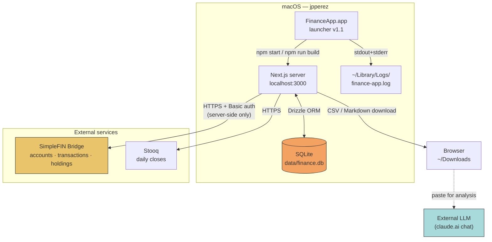
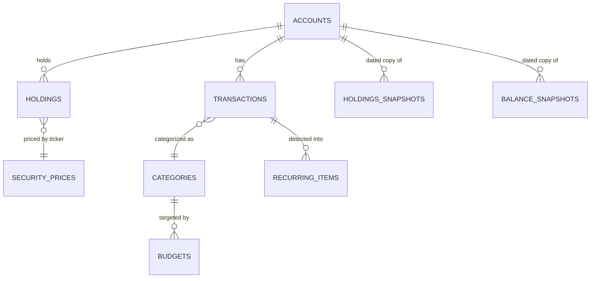
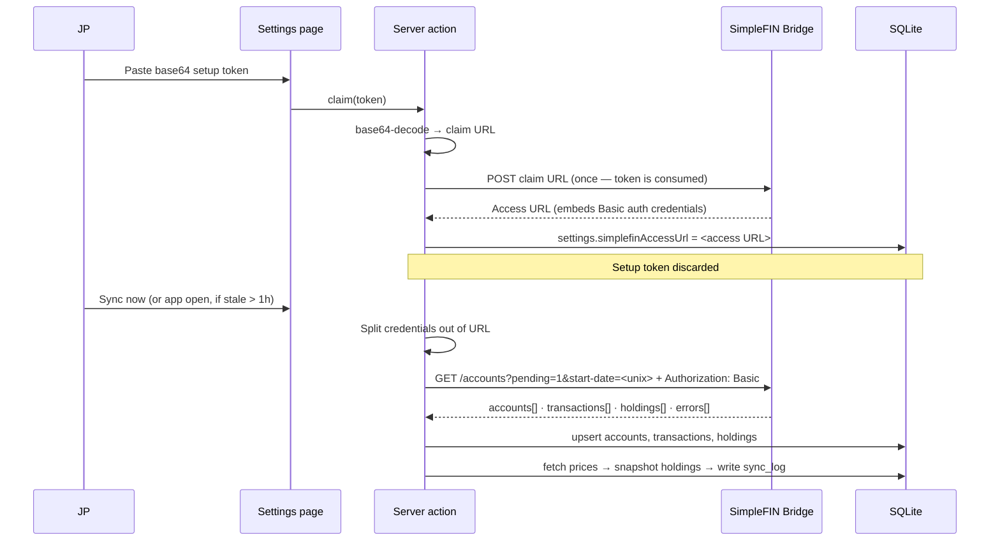

# Finance App — Capabilities & Structure

> **Scope.** Complete functional and structural documentation for the self-hosted personal finance
> application at `/Users/jpperez/finance-app`. This note is the canonical vault reference; the
> companion repo (`finance-app-docs`) carries the same material in GitHub-conventional form
> (README, ADRs, runbooks, CI, issue templates).
>
> **Provenance.** Assembled from the build sessions that produced the app. Where a detail was
> established in-session it is stated plainly. Where it is inferred from context and has not been
> re-read against current source, it is marked **[VERIFY]** and listed in
> `docs/VERIFY-LEDGER.md`. Nothing here should be treated as verified until the ledger is cleared
> against the live tree.

---

## 1. Executive summary

`finance-app` is a **local-first, single-user personal finance and portfolio system**. It runs
entirely on JP's Mac — Next.js server on `localhost:3000`, SQLite file on disk, no cloud tenancy,
no third-party account aggregation service holding the data. The only outbound network calls are to
**SimpleFIN Bridge** (account, transaction, and holdings sync) and **Stooq** (daily security
prices).

It exists because the commercially available tools (Monarch, Copilot, Empower) either would not let
JP hold the data locally, would not model an RSU-heavy pre-retirement balance sheet honestly, or
would not export in a shape usable for external analysis. The app was built to be the
**instrument panel for the March 1, 2027 retirement transition** — which is why position history,
asset-class scoping, and analysis export are first-class features rather than afterthoughts.

**Design posture, in one line:** integer cents everywhere, current-state tables plus dated snapshot
tables, server-rendered aggregates, and a Dock icon that self-heals its own build.

---

## 2. System context



**Trust boundaries.**

| ID | Boundary | Control |
|---|---|---|
| `FA-TB-001` | Browser ⇄ Next.js server | Password login; loopback-only binding **[VERIFY]** |
| `FA-TB-002` | Next.js server ⇄ SimpleFIN | Access URL with embedded Basic auth, stored in SQLite settings; claim and sync both server-side (no CORS surface) |
| `FA-TB-003` | Next.js server ⇄ Stooq | Unauthenticated public CSV endpoints; ticker symbols leak in URLs |
| `FA-TB-004` | App ⇄ external LLM | **Manual only.** Exports are downloaded and pasted by hand. No API key in the app. See ADR-0006 |

---

## 3. Technology stack

| Layer | Choice | Notes |
|---|---|---|
| Framework | **Next.js (App Router)** | Route groups: `src/app/(app)/…` for authed pages, `src/app/api/…` for route handlers |
| Language | **TypeScript** | Strict; provider interfaces are explicitly typed (`ProviderAccount`, `ProviderTransaction`, `ProviderHolding`) |
| ORM | **Drizzle** | `src/db/schema.ts` is the single schema source; `db:generate` → `db:migrate` workflow |
| Database | **SQLite** (`data/finance.db`) | Synchronous better-sqlite3-style access (`.all()`, `.run()`) |
| Charts | **Recharts** **[VERIFY]** | Line, area, pie/donut, and Sankey (Reports) |
| Styling | Tailwind + CSS custom properties | Monarch-inspired token set, see §8 |
| Money | Integer cents, string math | `parseCents()` on ingest, `formatCents()` on render; strict integer guards |
| Runtime packaging | `FinanceApp.app` bundle | Bash launcher v1.1, custom icon, Dock-resident |
| Spec artifact | `BUILD_SPEC` | Numbered sections referenced in code comments (e.g. "BUILD_SPEC §9" for price fetch) |

---

## 4. Application structure

```
/Users/jpperez/finance-app
├── data/
│   ├── finance.db                     # SQLite — the entire application state
│   └── finance.db.bak-YYYYMMDD        # Manual backups (created before every repair)
├── drizzle/                           # Generated migrations           [VERIFY]
├── src/
│   ├── app/
│   │   ├── (app)/
│   │   │   ├── page.tsx               # Dashboard (widget grid)
│   │   │   ├── accounts/              # Accordion by account type + subtotals
│   │   │   ├── transactions/
│   │   │   ├── budget/                # Accordion by category group
│   │   │   ├── portfolio/
│   │   │   │   ├── page.tsx           # Symbol trend chart + holdings table
│   │   │   │   └── actions.ts         # createHolding / updateHolding /
│   │   │   │                          #   deleteHolding / importHoldingsCsv
│   │   │   ├── recurring/             # Detected recurring items
│   │   │   ├── reports/               # Sankey cash-flow + period reports
│   │   │   └── settings/
│   │   │       ├── simplefin-connect-form.tsx
│   │   │       └── actions.ts         # Claim server action
│   │   ├── api/
│   │   │   └── sync/route.ts          # POST /api/sync[?onlyIfStale=1]
│   │   └── login/
│   ├── db/
│   │   ├── index.ts                   # db handle
│   │   └── schema.ts                  # ALL tables
│   └── lib/
│       ├── sync/
│       │   ├── provider.ts            # Provider-agnostic interfaces + SyncResult
│       │   ├── simplefin.ts           # SimpleFIN protocol adapter
│       │   └── sync-engine.ts         # Orchestrates: accounts → txns → holdings → prices → snapshot
│       ├── holdings.ts                # Holdings domain logic
│       ├── holdings-snapshots.ts      # snapshotHoldingsForToday()
│       ├── prices.ts                  # Stooq fetch + latestPrice()
│       ├── portfolio.ts               # Portfolio aggregation + exports
│       ├── settings.ts                # Key/value settings incl. simplefinAccessUrl
│       └── money.ts                   # parseCents / formatCents        [VERIFY name]
└── .next/
    └── BUILD_ID                       # Presence = valid production build (launcher gate)
```

---

## 5. Data model

### 5.1 Table inventory

| ID | Table | Kind | Purpose |
|---|---|---|---|
| `FA-DM-001` | `accounts` | current-state | One row per account; type drives scope filters and accordion grouping |
| `FA-DM-002` | `transactions` | append | Synced + imported; pending flagged |
| `FA-DM-003` | `categories` / category groups | reference | Budget hierarchy; group names namespaced in Sankey (see ADR/bug FA-BUG-003) |
| `FA-DM-004` | `budgets` | current-state | Per-category period targets |
| `FA-DM-005` | `recurring_items` | derived | Detected recurrences; `expected_amount` **must** be INTEGER |
| `FA-DM-006` | `holdings` | current-state | Overwritten each sync — no history by design |
| `FA-DM-007` | `holdings_snapshots` | dated history | Daily position history; the portfolio historian |
| `FA-DM-008` | `balance_snapshots` | dated history | One row per account per day; feeds net-worth trend |
| `FA-DM-009` | `security_prices` | dated history | Daily closes per ticker from Stooq |
| `FA-DM-010` | `settings` | key/value | Includes `simplefinAccessUrl`, dashboard widget order/visibility |
| `FA-DM-011` | `sync_log` | append | Per-run outcome, counts, and provider-relayed errors |

### 5.2 `holdings_snapshots` — verbatim schema

The one table worth reproducing in full, because it is the app's only source of true position
history and its semantics are non-obvious:

```ts
/**
 * Daily snapshots of holdings state, written on every sync and after any
 * holdings mutation (manual CRUD or CSV import). One row per holding row per
 * day; same-day re-writes replace that day's rows per account. This is the
 * position-history record that makes true month-over-month portfolio
 * comparison possible (the `holdings` table itself is current-state only).
 */
export const holdingsSnapshots = sqliteTable(
  'holdings_snapshots',
  {
    id: integer('id').primaryKey({ autoIncrement: true }),
    /** ISO date (YYYY-MM-DD) the snapshot represents. */
    date: text('date').notNull(),
    accountId: integer('account_id').notNull().references(() => accounts.id),
    ticker: text('ticker').notNull(),
    name: text('name'),
    shares: text('shares').notNull(),
    costBasis: integer('cost_basis').notNull().default(0),
    assetClass: text('asset_class', {
      enum: ['stock', 'bond', 'cash', 'crypto', 'other'],
    }).notNull(),
    /** Market value in cents at snapshot time (live price or provider value). */
    marketValueCents: integer('market_value_cents'),
    source: text('source', { enum: ['manual', 'simplefin'] }).notNull().default('manual'),
    createdAt: integer('created_at').notNull(),
  },
  (table) => ({
    dateAccountIdx: index('holdings_snapshots_date_account_idx').on(table.date, table.accountId),
  })
);
```

**Write semantics — full daily replace.** `snapshotHoldingsForToday()` deletes today's rows and
re-inserts current state. Repeated calls converge to the latest state, and — critically — an
account whose holdings were emptied is correctly recorded as empty rather than retaining stale rows.

**Market value precedence:** live Stooq price × shares → provider-reported `market_value` → `null`.

**Inherent limitation:** history begins the day the feature shipped. It cannot be backfilled.
Months before that are reconstructed (month-end price × today's shares) and **labelled as
reconstructed** in the monthly export.

### 5.3 Money invariant

```
FA-INV-001  All monetary values are stored as INTEGER cents.
            Ingest:  parseCents(string)   — string math, never parseFloat
            Render:  formatCents(int)     — throws on non-integer input
            Guard:   typeof(col) = 'real' in SQLite is a corruption signal
```

This invariant has already been violated once and cost a day of debugging — see `FA-BUG-002`.

### 5.4 Entity relationships



---

## 6. Capability catalogue

### 6.1 Sync & ingestion

| ID | Capability | Detail |
|---|---|---|
| `FA-CAP-101` | SimpleFIN account sync | Balances, org metadata, currency; `balance-date` honoured |
| `FA-CAP-102` | SimpleFIN transaction sync | `pending=1` requested; `start-date` in unix seconds; depth is bank-dependent (~90d typical) |
| `FA-CAP-103` | SimpleFIN **holdings** sync | Parses all nine fields of the undocumented `/accounts` holdings array extension |
| `FA-CAP-104` | Manual sync + auto-sync | "Sync now" button; sync-on-open calls `POST /api/sync?onlyIfStale=1` (staleness threshold **1 hour**, relaxed from 12h) |
| `FA-CAP-105` | CSV transaction import wizard | Backfill path for history deeper than the bridge returns |
| `FA-CAP-106` | Holdings CSV import | `importHoldingsCsv` — also triggers a snapshot write |
| `FA-CAP-107` | Stooq daily price fetch | Held tickers + benchmarks; per-ticker outcome recorded in `priceFetch[]` on the sync result |
| `FA-CAP-108` | Sync log | Per-run counts and provider-relayed errors surfaced in Settings |

**Sync order matters:** accounts → transactions → holdings → **prices** → **snapshot**. The snapshot
runs last so market values use the freshest closes.

### 6.2 Portfolio

| ID | Capability | Detail |
|---|---|---|
| `FA-CAP-201` | Holdings table | Ticker, name, shares (fractional, stored as text), cost basis, market value, asset class, source |
| `FA-CAP-202` | Manual holdings CRUD | For accounts the provider does not report positions on |
| `FA-CAP-203` | Per-symbol value trend chart | Leads the Portfolio page; one line per ticker, price history × current shares |
| `FA-CAP-204` | Current-positions CSV export | On-the-fly generation, streamed to browser |
| `FA-CAP-205` | Monthly-history CSV export | **Snapshot-first**: real historical share counts where snapshots exist, reconstructed (and labelled) before that |
| `FA-CAP-206` | Analysis export (Markdown) | One button emits a structured markdown document containing all current + historical portfolio data, formatted for pasting into an external LLM |

### 6.3 Dashboard

| ID | Capability | Detail |
|---|---|---|
| `FA-CAP-301` | Drag-and-drop widget grid | Four widgets: net worth, breakdown, trend, accounts |
| `FA-CAP-302` | Server-persisted layout | Widget order and visibility stored server-side, not in localStorage — survives browser and device changes (ADR-0005) |
| `FA-CAP-303` | Multi-series trend chart | One colour per asset class, **total net worth in orange** |
| `FA-CAP-304` | View scope switcher | Pill control: All / Cash / Investments / Debt, cookie-backed, filters all dashboard aggregates **server-side** |

### 6.4 Accounts, budget, transactions, reports

| ID | Capability | Detail |
|---|---|---|
| `FA-CAP-401` | Accounts accordion | Collapsible cards grouped by account type with subtotals |
| `FA-CAP-402` | Budget accordion | Same pattern, grouped by category group |
| `FA-CAP-403` | Recurring detection | Median-based expected amount; unknown frequencies silently counted as monthly (**open gap**, see §11) |
| `FA-CAP-404` | Reports — Sankey cash flow | Multi-level income → group → category flow |
| `FA-CAP-405` | Transactions ledger | Search, categorize, pending indicators |

### 6.5 Runtime & operations

| ID | Capability | Detail |
|---|---|---|
| `FA-CAP-501` | Dock launcher v1.1 | Detects a valid build via `.next/BUILD_ID`, auto-builds when missing, falls back to dev mode on build failure, waits up to 60s, alerts via `osascript` on failure |
| `FA-CAP-502` | Centralised log | `~/Library/Logs/finance-app.log`, one `--- launcher <date> ---` marker per click |
| `FA-CAP-503` | Password login | Gate on `/login` before any `(app)` route |
| `FA-CAP-504` | Dark mode | `color-scheme` declarations + global form-control CSS |

---

## 7. SimpleFIN integration

### 7.1 Protocol flow



### 7.2 The nine holdings fields

SimpleFIN's holdings array is an undocumented extension to `/accounts`. The adapter's parsed shape:

```ts
interface SimpleFinHolding {
  id: string;
  created?: number;
  currency?: string;
  cost_basis?: string;
  description?: string;
  market_value?: string;
  purchase_price?: string;
  shares?: string;
  symbol?: string;
}
```

Normalised into the provider-agnostic interface:

```ts
export interface ProviderHolding {
  externalId: string;
  accountExternalId: string;
  ticker: string;
  description?: string;
  /** Decimal string; MAY be fractional (e.g. "100.03"). Stored as text. */
  shares: string;
  /** Total cost basis in integer cents. */
  costBasisCents: number;
  /** Provider-reported total market value in integer cents, if given. */
  marketValueCents: number | null;
  /** Provider-reported purchase price in integer cents, if given. */
  purchasePriceCents: number | null;
  currency: string | null;
  createdAtUnixSeconds: number | null;
}
```

### 7.3 Option A merge semantics (ADR-0003)

> **On accounts the provider reports holdings for, provider data replaces local holdings.
> On accounts the provider does not report holdings for, manual holdings are preserved untouched.**

This is what lets the Fidelity positions auto-maintain while manually tracked assets (TIAA
Traditional, unvested equity, anything outside a linked institution) survive every sync.

### 7.4 Known provider data-quality traps

| ID | Trap | Impact | Mitigation |
|---|---|---|---|
| `FA-DQ-001` | NET reported as **owned + unvested combined** | Overstated equity concentration ($226K reported vs. $72K owned / $154.6K unvested) | Split manually; never trust a single-line employer-equity position |
| `FA-DQ-002` | Asset class mislabelling (VAIPX tagged `stock`, is an intermediate TIPS bond fund) | Allocation analysis inverted | Override `assetClass` manually; audit after every new position appears |
| `FA-DQ-003` | Account type mislabelling (savings typed as brokerage) | Scope filters and net-worth breakdown wrong | Audit account types after first sync of any new institution |

**Standing rule:** any allocation conclusion drawn straight from a fresh SimpleFIN sync is
provisional until `FA-DQ-001` through `FA-DQ-003` have been re-checked. The first portfolio analysis
run against this app concluded the opposite of the truth (assumed aggressive; actually ~15%
aggressive / 85% conservative) precisely because these three defects were live.

---

## 8. Design system

Monarch-inspired token set, applied globally:

| Token | Value |
|---|---|
| Canvas | Off-white (not pure white) |
| Surface | White floating cards |
| Shadow | Soft, low-opacity, large radius |
| Corner radius | 16px |
| Typeface | Inter |
| Numerals | Tabular figures (column alignment in every money table) |
| Accent | Orange — reserved for the aggregate/total series |
| Density | Accordion-collapsible groups with subtotals over long flat lists |

Dark mode requires explicit `color-scheme` declarations plus global rules for form controls;
without them inputs render unreadable (`FA-BUG-004`).

---

## 9. Operational runbook

### 9.1 The build discipline (the single most important operational fact)

The app runs in **production mode**. Source edits are invisible to the running compiled bundle.

```bash
cd /Users/jpperez/finance-app
lsof -ti :3000 | xargs kill      # stop the running server
unzip -o ~/Downloads/<change>.zip -d .
npm run db:generate && npm run db:migrate   # ONLY if the change touched schema.ts
npm run build                    # ALWAYS
```

Then relaunch from the Dock. Skipping `npm run build` is the #1 cause of "my change didn't do
anything." Skipping the migration pair is the #1 cause of server-side page crashes
(`no such column: …`, `no such table: …`).

### 9.2 Health checks

```bash
# Migration state
sqlite3 data/finance.db "PRAGMA table_info(holdings);" | grep -c market_value_cents   # expect 1
sqlite3 data/finance.db "SELECT name FROM sqlite_master WHERE name='holdings_snapshots';"

# Integer-cents invariant (FA-INV-001)
sqlite3 data/finance.db "SELECT COUNT(*) FROM recurring_items WHERE typeof(expected_amount)='real';"  # expect 0

# Runtime
tail -30 ~/Library/Logs/finance-app.log
curl -s -o /dev/null -w '%{http_code}\n' http://localhost:3000
```

### 9.3 Backup before every repair

```bash
cp data/finance.db data/finance.db.bak-$(date +%Y%m%d)
```

Non-negotiable. `data/finance.db` is the entire application state — there is no server-side copy.

### 9.4 Launcher v1.1 behaviour

| Condition | Behaviour |
|---|---|
| Server already responding | Opens the URL immediately |
| `.next/BUILD_ID` present | `npm start` |
| `.next` exists but no `BUILD_ID` (dev-mode residue) | Runs `npm run build`, then `npm start` |
| Build fails | Falls back to `npm run dev` |
| Not up within 60s | `osascript` alert pointing at the log |

Full script preserved at `reference/launcher-v1.1.sh`.

---

## 10. Defect ledger (resolved)

| ID | Defect | Root cause | Fix |
|---|---|---|---|
| `FA-BUG-001` | SimpleFIN requests failing with credentials in URL | Access URL embeds Basic auth inline; fetch did not honour it | Split credentials out of the URL, send as an `Authorization: Basic` header |
| `FA-BUG-002` | Recurring page crash in `formatCents` | Median calculation wrote **fractional** cents into `recurring_items.expected_amount`, violating the strict integer guard at render | Repair rows (`CAST(ROUND(x) AS INTEGER)` where `typeof='real'`) + round at write time |
| `FA-BUG-003` | Reports crash: `RangeError: Maximum call stack size exceeded` | Sankey nodes keyed by display name across levels; a category sharing its group's name produced a self-link/cycle | Namespace node keys by level + hard self-link guard |
| `FA-BUG-004` | Dark-mode inputs unreadable | Missing `color-scheme`; form controls inheriting light UA styles | `color-scheme` declarations + global form-control CSS |
| `FA-BUG-005` | Dock icon silently does nothing after launcher replacement | `com.apple.quarantine` xattr on the downloaded executable broke Gatekeeper's prior approval of the bundle | `xattr -cr /Applications/FinanceApp.app`, then right-click → Open → Open once |
| `FA-BUG-006` | "Could not find a production build" after a dev run | Launcher v1.0 checked for the `.next` **folder**, which dev mode also creates | v1.1 checks `.next/BUILD_ID` |

---

## 11. Open gaps and deferred work

| ID | Item | Status |
|---|---|---|
| `FA-OPEN-001` | Symbol trend chart still uses price-reconstruction, not `holdings_snapshots` | Deferred until recorded history is deep enough |
| `FA-OPEN-002` | View scope pill honoured only by Dashboard; Reports/Transactions/Portfolio ignore it | Infrastructure is global; wiring is the work |
| `FA-OPEN-003` | Recurring items with unrecognised frequency silently count as monthly | Needs surfacing in the UI |
| `FA-OPEN-004` | No visibility into which dates/months have recorded snapshots | Small Portfolio-page section proposed |
| `FA-OPEN-005` | Multi-currency: fields exist end-to-end, nothing converts | Unscheduled |
| `FA-OPEN-006` | No duplicate-transaction detection or transfer-pair review | Unscheduled |
| `FA-OPEN-007` | No per-symbol TWR/IRR, realized vs. unrealized, or dividend tracking | Unscheduled |
| `FA-OPEN-008` | Retirement/FIRE projection widget (glide path to 2027-03-01, SWR math) | High relevance, unscheduled |
| `FA-OPEN-009` | In-app LLM portfolio scoring | **Blocked by design** — see ADR-0006 |

---

## 12. Constraint: no in-app LLM scoring (ADR-0006)

A requested feature was a Portfolio-page button that sends current + historical data to Claude and
returns a 0–100 resilience score against a sustained one-year 10% drawdown.

**The blocker is structural, not technical.** A claude.ai Pro subscription and the Anthropic API are
separate products. Pro covers the chat surfaces (claude.ai, desktop, mobile, Claude Code); it does
not include API access, and there is no supported way for a local Next.js app to authenticate as
"me on Pro." Any in-app call would require a separately billed API key.

**Accepted alternative, and what shipped:** `FA-CAP-206` — the analysis export button produces a
structured markdown document with all current and historical portfolio data, downloaded to
`~/Downloads` and pasted into a chat session by hand. Same analytical outcome, zero credentials in
the app, zero incremental cost.

---

## 13. Relationship to the 2027 retirement plan

This app is the measurement layer for the retirement transition; the strategy documents are its
consumers.

| Downstream artifact | What it consumes |
|---|---|
| `2026-pre-retirement-tax-plan.md` | Account balances, contribution tracking |
| `rsu-retention-retirement-timing.md` | NET position split (owned vs. unvested) — depends on `FA-DQ-001` being corrected |
| Fortress portfolio design | Asset-class allocation via scope filters; two-institution split (Fidelity liquid / TIAA floor) |

**Consequence:** data-quality defects in §7.4 are not cosmetic. They previously inverted an
allocation conclusion. Correct them before any allocation decision is taken from this app's output.

---

## 14. Version history

| Version | Date | Change |
|---|---|---|
| 1.0.0 | 2026-08-16 | Initial consolidated documentation reconstructed from build sessions |

---

## 15. Verify ledger (summary)

Items in this note not yet re-read against the live source tree at `/Users/jpperez/finance-app`.
Full ledger with clearing procedure: `docs/VERIFY-LEDGER.md`.

| ID | Claim | How to clear |
|---|---|---|
| `V-001` | Chart library is Recharts | `grep -r "recharts" package.json` |
| `V-002` | Money helpers live in `src/lib/money.ts` | `grep -rn "export function formatCents" src/` |
| `V-003` | Migrations directory is `drizzle/` | `ls drizzle/` and check `drizzle.config.ts` |
| `V-004` | Server binds loopback only | `lsof -nP -iTCP:3000 -sTCP:LISTEN` |
| `V-005` | Complete table inventory (§5.1) | `sqlite3 data/finance.db ".tables"` |
| `V-006` | Route/page list (§4) | `find src/app -name page.tsx` |
| `V-007` | `holdings_snapshots` DDL matches §5.2 verbatim | `sqlite3 data/finance.db ".schema holdings_snapshots"` |
